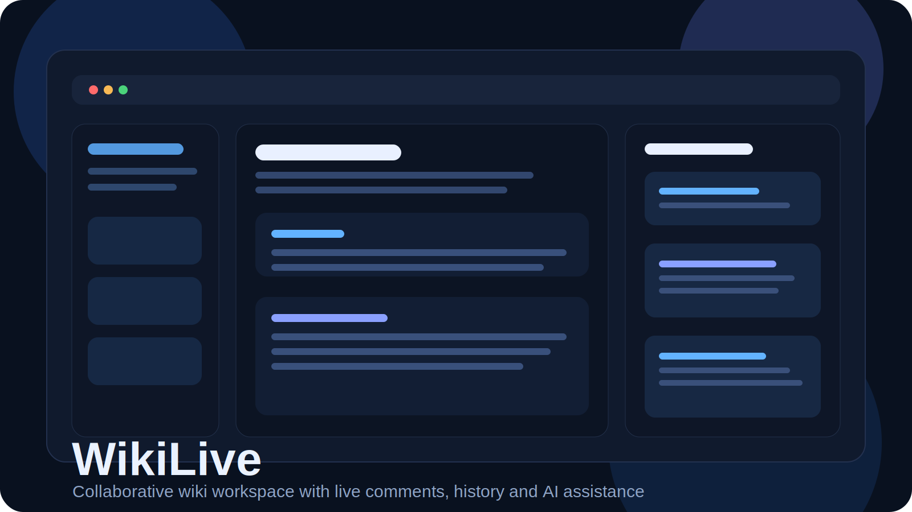
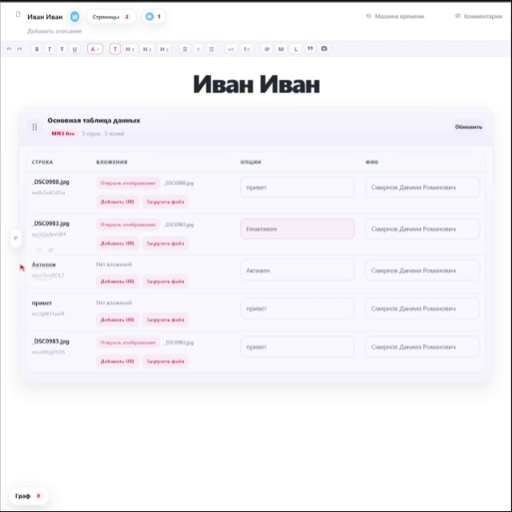
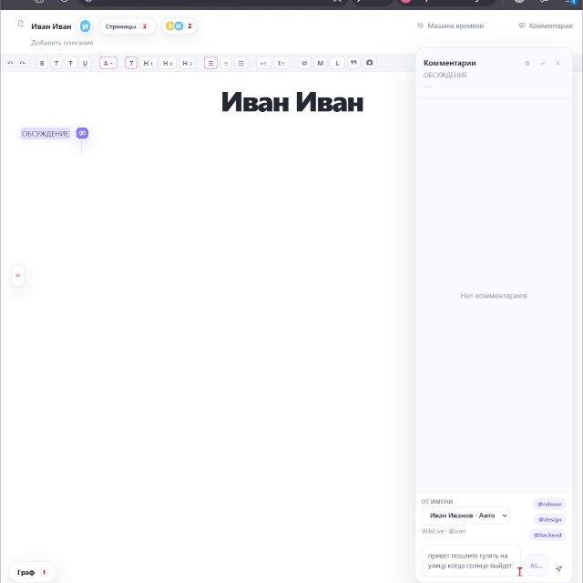
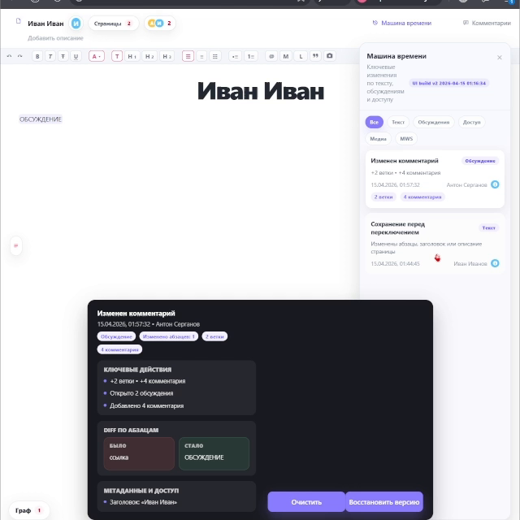
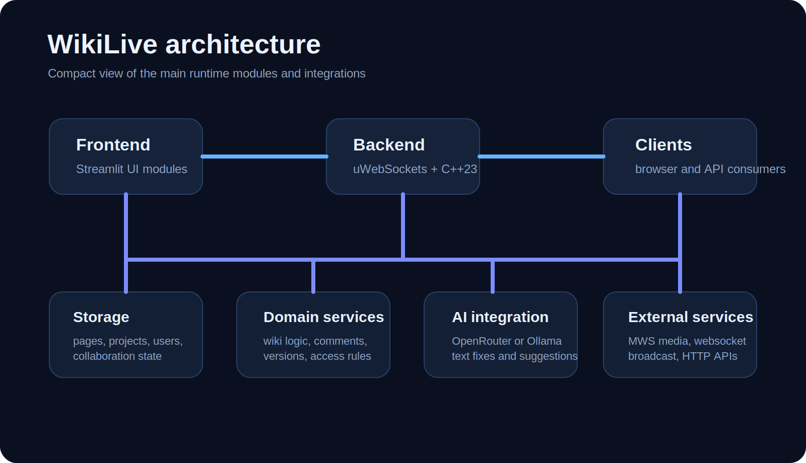

# WikiLive



WikiLive is a collaborative knowledge workspace built during the MTS Tech Hack. It combines a high-performance C++ backend with a lightweight Streamlit interface to make technical content editing, discussion, version tracking, and AI-assisted work feel fast and practical.

The project is centered around live team workflows: editing pages, leaving structured comments, reviewing history, managing access, attaching media from MWS, and using AI helpers directly inside the workspace.

## What it does

- Real-time collaborative wiki for project and knowledge pages
- Fine-grained comments with replies, likes, pause/resume, edit and resolve flows
- Version history and time-machine style rollback for page changes
- Project, page, user, and group level access control
- AI assistance for text improvement and inline content suggestions
- MWS integration for uploading and embedding media blocks
- WebSocket-ready architecture for live collaboration updates

## Product tour

<p align="center">
  
  
  
</p>

## Demo

- Interactive showcase page in `docs/` (ready for GitHub Pages): [docs/index.html](docs/index.html)
- Demo video: [docs/media/wikilive-demo.mp4](docs/media/wikilive-demo.mp4)

## Architecture



Core layers:

- `frontend/` - Streamlit application and UI modules
- `src/server/` - HTTP routing and API surface
- `src/core/` - application bootstrap and dependency wiring
- `src/services/` - domain services, AI integration, MWS integration
- `src/storage/` - local persistence for users, pages, projects, collaboration state
- `src/wiki/` - wiki-specific business logic and models

## Stack

- Backend: `C++23`
- HTTP layer: `uWebSockets`
- Frontend: `Streamlit`
- Data exchange: `nlohmann/json`
- External integrations: `libcurl`
- Local orchestration: `Docker Compose`

## Quick start

```bash
docker compose up --build
```

Available after startup:

- Frontend: `http://localhost:8501`
- Backend health check: `http://localhost:3000/health`

## Local development

Backend:

```bash
cmake -S . -B build
cmake --build build
```

Frontend:

```bash
cd frontend
streamlit run app.py
```

## Repository notes

The repository also includes planning and tracker materials in [`docs/`](docs/) that were used during the hackathon delivery process.
